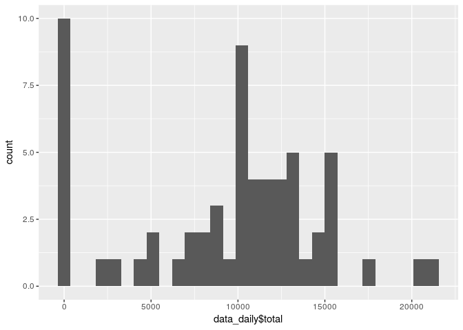
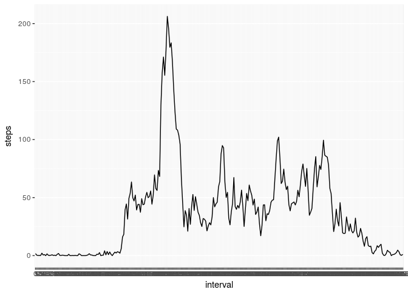
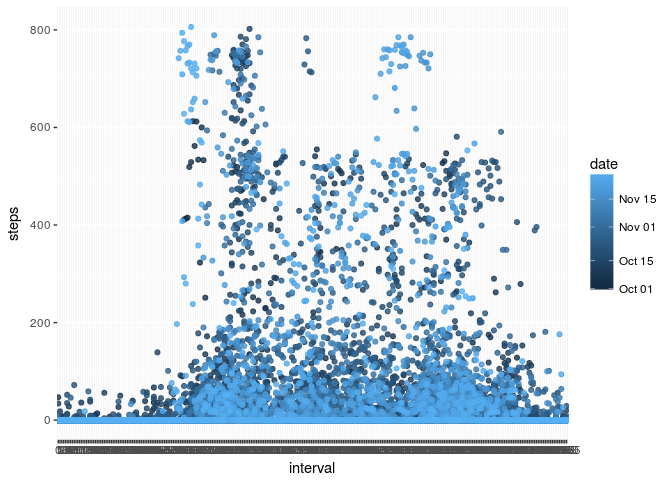
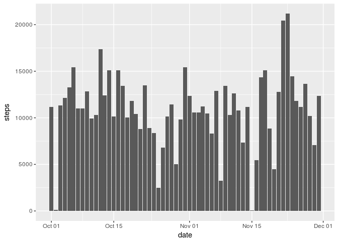
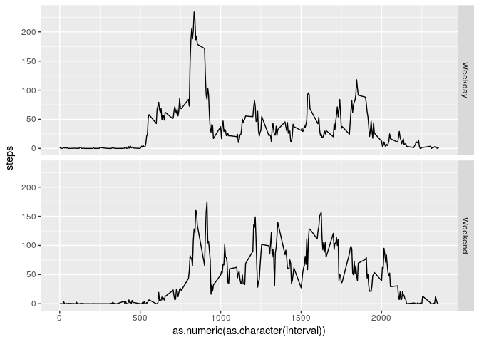

# Reproducible Research: Peer Assessment 1


# 1. Loading and preprocessing the data


```r
if (!file.exists("activity.csv")) {
  fileUrl <- "https://d396qusza40orc.cloudfront.net/repdata%2Fdata%2Factivity.zip"
  download.file(fileUrl, "data_activity.zip", method="curl")
  unzip("activity.zip")
}

library(dplyr)
```

```
## 
## Attaching package: 'dplyr'
```

```
## The following objects are masked from 'package:stats':
## 
##     filter, lag
```

```
## The following objects are masked from 'package:base':
## 
##     intersect, setdiff, setequal, union
```

```r
library(lubridate)
```

```
## 
## Attaching package: 'lubridate'
```

```
## The following object is masked from 'package:base':
## 
##     date
```

```r
library(ggplot2)

data_raw <- read.csv("activity.csv", colClasses = c("numeric", "character", "numeric")) %>%
  mutate(date = ymd(date), interval = as.factor(interval))
```

# 2. What is mean total number of steps taken per day?


```r
data_daily <- data_raw %>% 
  group_by(date) %>%
  summarise(total = sum(steps, na.rm=TRUE), average = mean(steps, na.rm=TRUE))

qplot(data_daily$total, geom="histogram")
```

```
## `stat_bin()` using `bins = 30`. Pick better value with `binwidth`.
```

<!-- -->

# 3. Mean and Median number of steps


```r
cat("Mean: ",mean(data_daily$total, na.rm=TRUE), "\n",
  "Median: ", median(data_daily$total, na.rm=TRUE), sep="")
```

```
## Mean: 9354.23
## Median: 10395
```

# 4. What is the average daily activity pattern?


```r
g <- ggplot(data_raw, aes(interval, steps)) 
g + stat_summary(fun.y = mean, geom = "line", na.rm = TRUE, group = 1)
```

<!-- -->

```r
# qplot(date, average, data=data_daily, geom="line")
```

# 5. The 5-minute interval that, on average, contains the maximum number of steps


```r
data <- data_raw %>% group_by(interval) %>%
  summarise(steps = mean(steps, na.rm=TRUE))

data[which.max(data$steps),]
```

```
## # A tibble: 1 x 2
##   interval    steps
##     <fctr>    <dbl>
## 1      835 206.1698
```
# 6. Code to describe and show a strategy for imputing missing data


```r
missingValues <- sum(is.na(data_raw$steps))
cat("Number of missing values:", missingValues)
```

```
## Number of missing values: 2304
```

## 6.a. Searching for pattern based on interval

Some pattern of steps activity based on daily intervals and date, 


```r
g <- ggplot(data_raw, aes(interval, steps))
g + geom_point(aes(colour = date), alpha=0.8)
```

```
## Warning: Removed 2304 rows containing missing values (geom_point).
```

<!-- -->
Hence we impute missing data using `mice` library


```r
library(mice)

# Convert all data to numeric
data_numeric <- transmute(data_raw, steps = as.numeric(steps), 
                          date = as.numeric(date), 
                          interval = as.numeric(interval))

# Use mice library and Predictive Mean Matching to impute values
tempData <- mice(data_numeric,m=5,maxit=10,meth='pmm',seed=500, printFlag = FALSE)

# Average imputed values and store in new dataframe
data_inputed <- data_raw
data_inputed$steps[is.na(data_inputed$steps)] <- rowMeans(tempData$imp$steps)
```

# 7. Histogram of the total number of steps taken each day after missing values are imputed


```r
g <- ggplot(data_inputed, aes(date, steps)) 
g + stat_summary(geom = "bar", fun.y = sum, na.rm = TRUE)
```

<!-- -->

## Mean and median after imputation

Mean and median of total steps become higher after imputation


```r
data_inputed_daily <- data_inputed %>%
  group_by(date) %>%
  summarise(total = sum(steps))
  
cat("Mean: ",mean(data_inputed_daily$total, na.rm=TRUE), "\n",
  "Median: ", median(data_inputed_daily$total, na.rm=TRUE), sep="")
```

```
## Mean: 10878.82
## Median: 11162
```

# 8. Panel plot comparing the average number of steps taken per 5-minute interval across weekdays and weekends

First calculate if dates are weekday or weekend, then use ggplot to plot mean of steps with grid panels as weekend


```r
# Calculate if dates are weekday and weekend
data <- data_raw %>%
  mutate(wd = wday(date), 
         isWeekEnd = factor(wd %in% c(1, 7), 
                            labels = c("Weekday", "Weekend")))

# Plot mean of steps with grid panels as weekend
g <- ggplot(data, aes(as.numeric(as.character(interval)), steps)) 
g + stat_summary(fun.y = mean, geom="line") + 
  facet_grid(isWeekEnd ~ .)
```

```
## Warning: Removed 2304 rows containing non-finite values (stat_summary).
```

<!-- -->

